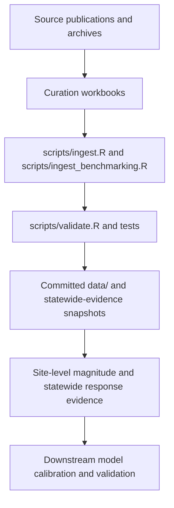

# Calibration and Validation Data for Agroecosystem Carbon and Greenhouse Gas Models

[](https://github.com/ccmmf/cal-val-data/blob/develop/LICENSE)
-lightgrey.svg)

Curated field observations of soil carbon and greenhouse gas responses to management, with provenance, for calibrating and validating ecosystem and biogeochemical models.

This repository holds two kinds of evidence, each with a trail back to its source:

- **Site level observations**: curated measurements (soil organic carbon stocks, N2O, CH4 and CO2 fluxes, and supporting soil, yield and biomass variables), site and treatment metadata, named treatment contrasts, management histories, and bibliographic and methodological context, in [`data/`](https://github.com/ccmmf/cal-val-data/tree/develop/data). Values are stored as each source reports them, in reported units.
- **Statewide synthesis evidence**: effect sizes and reference values extracted from syntheses and meta analyses, with the selected response targets, in [`data_raw/statewide_benchmarking/`](https://github.com/ccmmf/cal-val-data/tree/develop/data_raw/statewide_benchmarking).

Website: <https://ccmmf.github.io/cal-val-data/>

## What the data can and cannot support

The two kinds of evidence do different jobs. The [evidence report](reports/calibration-validation-data.qmd) sets out the detail.

- **Site level observations constrain magnitude.** They test whether a model produces the right stock, the right flux, at a real place: six California fields, with 630 soil carbon stock and gas flux target records. Soil carbon and gas flux are measured at different sites, and no site carries both. The 24 named practice contrasts sit almost entirely at the two annual crop soil sites, Russell Ranch and Salinas, with one at Modesto; none are in the Delta or under rice. Chamber and tower measurements are different measurement supports and are not interchangeable.
- **Statewide synthesis evidence constrains response.** It tests whether, when a practice changes, a model responds in a direction and rough magnitude consistent with published syntheses. Six of the 18 practice by outcome cells carry a spread and can enter a likelihood; two more serve as sign checks.
- **Neither independently establishes cross domain skill.** Six sites cannot establish how California cropland responds to a management change, and a synthesis says how a response goes, not what the stock or flux is at a given field. Because no site pairs soil carbon with flux at useful density, a parameter set reproducing soil carbon at Davis has never been tested for methane in the Delta. The two bodies of evidence check each other, which is the main reason for carrying both.

## Start here

| Page | What it covers |
| -------------------------------------------------------------------------- | ------------------------------------------------------------------------------------------------------------------------------ |
| [Calibration and Validation Data](reports/calibration-validation-data.qmd) | The evidence report: what the repository holds, what it supports, and what is missing |
| [Part A: Site-Level Data](reports/site-level-data.qmd) | The six sites, their target records, and practice contrasts |
| [Part B: Statewide Evidence](reports/statewide-evidence.qmd) | Synthesis and meta analysis evidence for statewide response |
| [Data Collection Protocol](docs/data-collection-protocol.qmd) | How datasets are found, curated and documented (working draft) |
| [Data Requirements (2024)](docs/data-requirements.qmd) | What model validation was to require of a dataset, as set out in December 2024; a dated reference, not a record of what is met |
| [Data Reference](docs/data-reference.qmd) | Datasets, variables, table schemas, coverage and curation conventions |

## How information moves through the repository



The Google Sheet workbooks are the source of truth. The CSVs in `data/` and `data_raw/statewide_benchmarking/` are generated exports and must not be hand edited. They are committed so consumers read a stable, documented snapshot.

## Scope and repository boundary

This repository owns measured and synthesized evidence with its provenance: the measured site values, the evidence extracted from published syntheses, and the record of where each value came from. Model configuration, imputation, calibration code and model specific transformations remain downstream, and so do initial conditions, gap filled or imputed events, day of year imputation, fold assignment and parameter priors. Site level values are stored as each source reports them, with no unit or statistic conversion. Those downstream steps are properties of a particular model and a particular study, so they live with whatever consumes the data. Keeping this layer neutral is what lets a second model or analysis reuse the same tables.

## Quick start: validate the snapshot

[`scripts/validate.R`](https://github.com/ccmmf/cal-val-data/blob/develop/scripts/validate.R) checks every generated `data/*.csv` against [`datapackage.json`](https://github.com/ccmmf/cal-val-data/blob/develop/datapackage.json). It needs only base R plus `jsonlite` and `readr`.

```bash
Rscript scripts/validate.R
```

Tests under [`tests/testthat/`](https://github.com/ccmmf/cal-val-data/tree/develop/tests/testthat) run the same checks via testthat, plus checks on the statewide evidence; they also need `testthat` and `here`.

```bash
Rscript -e 'testthat::test_dir("tests/testthat")'
```

CI ([`.github/workflows/validate.yml`](https://github.com/ccmmf/cal-val-data/blob/develop/.github/workflows/validate.yml)) also checks every table against its declared types, keys and foreign keys with frictionless.

```bash
frictionless validate datapackage.json
```

Loading tables, regenerating the snapshot from the workbooks, and the full schema are described in the [data reference](docs/data-reference.qmd).

## Site

The site at <https://ccmmf.github.io/cal-val-data/> is built with Quarto from `_quarto.yml`:

```bash
quarto render
quarto publish gh-pages
```

The report, protocol and requirements pages are converted from Google Docs, which remain the source of their text; each page links its document and gives the date it was last synchronised.

## Attribution

Curated data derives from sources (public data archives and journals) that require attribution under CC-BY. Cite the original sources listed in [`data/citations.csv`](https://github.com/ccmmf/cal-val-data/blob/develop/data/citations.csv) and, for the synthesis evidence, in the `citation` and `doi` columns of [`data_raw/statewide_benchmarking/extracted_evidence.csv`](https://github.com/ccmmf/cal-val-data/blob/develop/data_raw/statewide_benchmarking/extracted_evidence.csv). Each site level dataset's provenance and curation decisions are recorded in its `data_raw/<dataset_id>/data_entry_report.md` under [`data_raw/`](https://github.com/ccmmf/cal-val-data/tree/develop/data_raw); the synthesis evidence has its [`data_ingest_report.md`](https://github.com/ccmmf/cal-val-data/blob/develop/data_raw/statewide_benchmarking/data_ingest_report.md).

## License

Code in this repository (`scripts/`, `tests/`) is BSD-3-Clause; see [LICENSE](https://github.com/ccmmf/cal-val-data/blob/develop/LICENSE).
