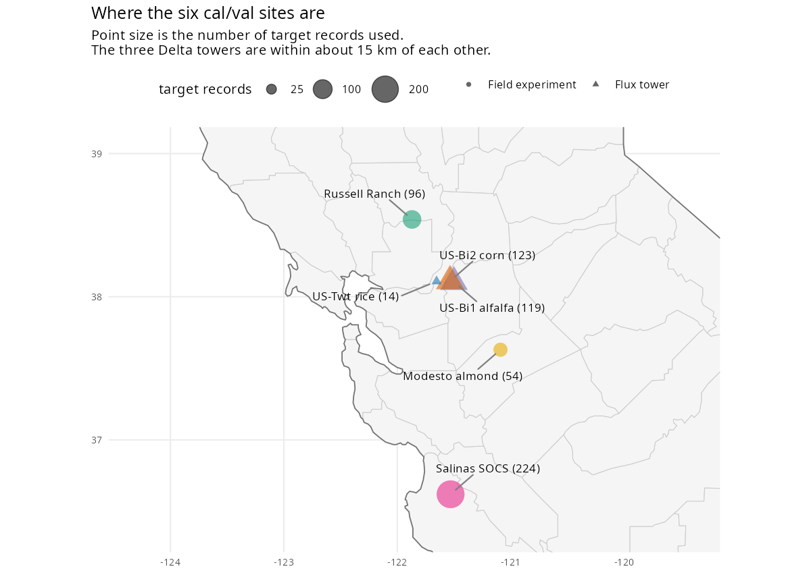
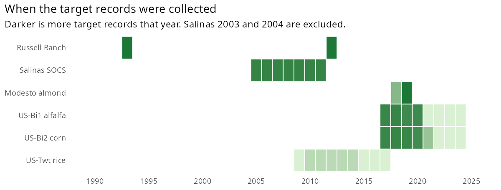
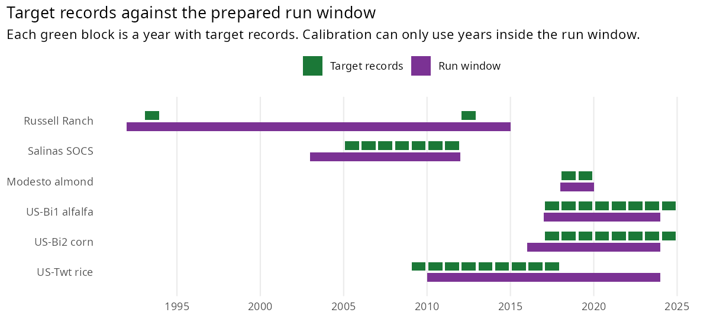
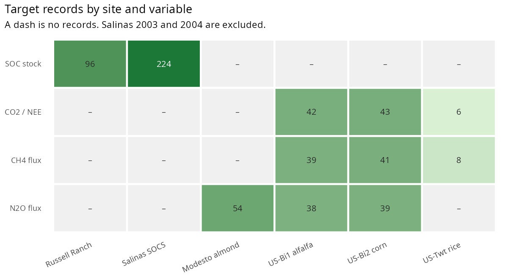
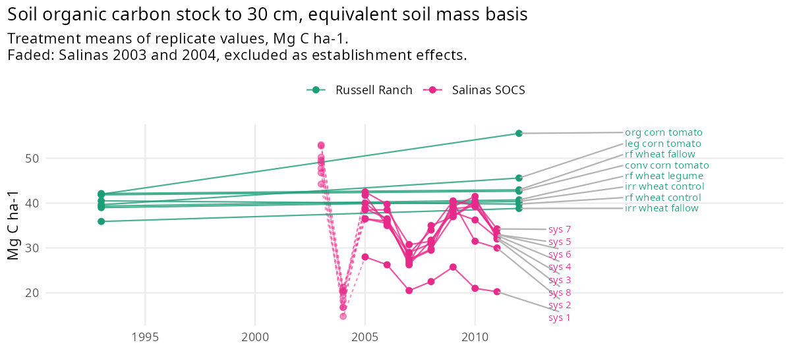
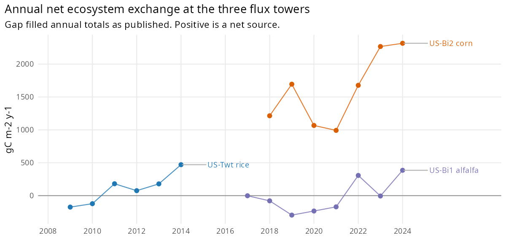

## A1. The six sites {#a1-the-six-sites}

{#fig-a1-site-map width=100% fig-align="center" fig-alt="Map of central California with county outlines, longitude -124 to -120 and latitude about 36.3 to 39.2. Circles mark Russell Ranch (96), Modesto almond (54) and Salinas SOCS (224). Three overlapping triangles in the Delta mark US-Twt rice (14), US-Bi2 corn (123) and US-Bi1 alfalfa (119). Point size scales with the number of target records."}

Five of the six sit in a narrow band of the Central Valley and Delta. Salinas is the outlier, a coastal vegetable system roughly 160 km south of the rest. The three flux towers cluster within about 15 km of each other on Delta peat islands, which means they share a climate, a soil history and a drainage regime. They are three views of one landscape rather than three independent samples of California.

| Site | Crop | Location | Observed | Targets | Trts |
| :------------------- | :-------------------- | :------------- | :--------- | :------ | :--- |
| Russell Ranch, Davis | corn / tomato / wheat | 38.54, -121.87 | 1993, 2012 | 96 | 13 |
| Salinas SOCS | lettuce / broccoli | 36.62, -121.53 | 2005-2011 | 224 | 8 |
| Modesto almond | almond | 37.63, -121.09 | 2018-2019 | 54 | 2 |
| US-Bi1, Bouldin | alfalfa | 38.10, -121.50 | 2017-2024 | 119 | 2 |
| US-Bi2, Bouldin | corn | 38.11, -121.54 | 2017-2024 | 123 | 1 |
| US-Twt, Twitchell | rice | 38.11, -121.65 | 2009-2017 | 14 | 3 |

: The six sites. {#tbl-a1-six-sites}

Targets are the SOC stock and gas flux records the model is scored against, 630 in all, with Salinas 2003 and 2004 excluded as described in A5. They are records, not independent measurements. Other data the repository holds are described in the [appendix](using-the-two-together.qmd#appendix-data-held-but-not-used-as-targets).

The six sites are also two different kinds of thing. Three are replicated field experiments with a treatment structure that allows calculation of practice change effects. Three are eddy covariance towers with no within site management contrast; the extra treatments listed for US-Bi1 and US-Twt in the table are separate measurement fields or tower deployments, not management practices. Each tower is unreplicated, the accepted limitation of eddy covariance, and the two Bouldin towers can be compared with each other, as A7 describes.

## A2. When the measurements happened {#a2-when-the-measurements-happened}

{#fig-a2-target-records-by-year width=100% fig-align="center" fig-alt="Tile chart of years 1990 to 2025, one row per site. Russell Ranch has dark tiles in 1993 and 2012. Salinas SOCS has tiles for every year from 2005 to 2011. Modesto almond has a light tile in 2018 and a dark tile in 2019. US-Bi1 alfalfa and US-Bi2 corn have tiles from 2017 to 2024, darker to 2020 and lighter after. US-Twt rice has light tiles from 2009 to 2017, lightest in 2009 and from 2015 to 2017."}

Russell Ranch has two campaigns, 1993 and 2012, and Salinas is annual from 2005 to 2011. The towers only begin in 2017, except US-Twt, which runs 2009 to 2017 and thins to one record a year from 2015. No other site has measurements from 2015 and 2016.

## A3. Coverage against the prepared run windows {#a3-coverage-against-the-prepared-run-windows}

{#fig-a3-target-records-vs-run-window width=100% fig-align="center" fig-alt="Timeline by site from about 1992 to 2025, with green blocks for years with target records and a purple bar for each run window. Russell Ranch has blocks in 1993 and 2012 over a bar from 1992 to 2015. Salinas SOCS has blocks for 2005 to 2011 over a bar from 2003 to 2012. Modesto almond has blocks for 2018 and 2019 over a bar from 2018 to 2020. US-Bi1 alfalfa has blocks for 2017 to 2024 over a bar from 2017 to 2024, so the 2024 block lies past the bar. US-Bi2 corn has blocks for 2017 to 2024 over a bar from 2016 to 2024, with the 2024 block past the bar. US-Twt rice has blocks for 2009 to 2017 over a bar from 2010 to 2024."}

Calibration can only use years where an observation and a model run overlap, so this comparison decides how much of the curated data is reachable at all. Runs end where their management inputs end: the towers' recent management comes from the statewide monitoring product, which ends in 2023.

Russell Ranch, Salinas and Modesto line up well, because their run windows were set from the data. US-Bi1 and US-Bi2 have observations extending a year past their run windows, to 2024 against runs ending in 2023; extending those two runs would pick up a year of existing data once management inputs for 2024 are available.

US-Twt is the difficult case. Observations stop in 2017 while the run reaches 2023, because it was first built on the monitoring record, which runs to 2023; the years after 2017 are simulated but not scored, so six of fourteen run years have nothing to compare against. The run was deliberately extended back to 2010, where the site's published management record begins, to buy overlap. Even then the usable overlap is 2010 to 2017, and 13 of the site's 14 target records fall inside it, since the first annual NEE record is from 2009. Rice is also the system chosen to evaluate the methane response, so that evaluation rests on the site with the least data.

## A4. What is measured, and where {#a4-what-is-measured-and-where}

{#fig-a4-target-records-by-site-variable width=100% fig-align="center" fig-alt="Heat map with rows SOC stock, CO2 / NEE, CH4 flux and N2O flux and columns Russell Ranch, Salinas SOCS, Modesto almond, US-Bi1 alfalfa, US-Bi2 corn and US-Twt rice. SOC stock: Russell Ranch 96, Salinas SOCS 224. CO2 / NEE: US-Bi1 alfalfa 42, US-Bi2 corn 43, US-Twt rice 6. CH4 flux: US-Bi1 alfalfa 39, US-Bi2 corn 41, US-Twt rice 8. N2O flux: Modesto almond 54, US-Bi1 alfalfa 38, US-Bi2 corn 39. Every other cell is a dash."}

The division is clean. Soil carbon is effectively Russell Ranch and Salinas. Methane and CO~2~ come only from the three tower sites, measured by eddy covariance and, at the Bouldin sites, also by automated chamber.

::: {.callout-note title="Measurement support is recorded, and the kinds are not interchangeable"}
Tower eddy covariance integrates a flux over a footprint of hundreds of metres that shifts with the wind. A chamber gives a plot scale mean over well under a square metre. A soil core gives a point value at a stated depth. These are different quantities, which is why method and observation level travel with every value instead of being collapsed at ingest.
:::

Russell Ranch and Salinas both report stocks to 30 cm on an equivalent soil mass basis. Salinas uses the published stocks, which take the greatest measured bulk density as the reference, while Russell Ranch is recomputed per plot from its full soil profile. The 96 Russell Ranch equivalent soil mass records report a 0 to 30 cm interval, but the depth actually integrated runs from about 28 to 40 cm, because each plot is taken to its treatment's reference soil mass rather than to a fixed depth. That keeps each treatment comparable between the two sampling years, and it means model output should be compared on the same mass basis rather than at a fixed depth.

## A5. The soil carbon record {#a5-the-soil-carbon-record}

{#fig-a5-soil-carbon-record width=100% fig-align="center" fig-alt="Line chart of SOC stock in Mg C ha-1 against year from 1993 to 2012. Eight green Russell Ranch lines run from about 36 to 42 in 1993 to about 39 to 56 in 2012, with org corn tomato highest, labelled org corn tomato, leg corn tomato, rf wheat fallow, conv corn tomato, rf wheat legume, irr wheat control, rf wheat control and irr wheat fallow. Eight pink Salinas lines, labelled sys 1 to sys 8, sit near 44 to 53 in 2003 and fall to about 15 to 21 in 2004, both drawn faded and dashed, then vary between about 20 and 42 from 2005 to 2011, with sys 1 lowest."}

Russell Ranch has two campaigns, 1993 and 2012. That constrains a long term rate but says nothing about interannual behaviour. The organic corn and tomato system is the clear mover, which is the expected direction and a useful sanity check.

Salinas is sampled annually from 2003 to 2011, which provides the opportunity to evaluate the intra-annual dynamics represented by the model. However,

::: {.callout-warning title="The Salinas 2003 and 2004 campaigns are excluded"}
Mean stock falls from 49.2 Mg C ha^-1^ in 2003 to 18.6 in 2004, then recovers to 37.8 in 2005. The drop appears in every one of the eight systems and all four replicates, all 32 records of that campaign. A soil carbon stock to 30 cm fell this far, the authors explain, because of the change in management when the experiment began. Before it, the field had low intensity management with cover crops incorporated only by disking, and about 22 Mg ha^-1^ (wet weight) of compost the year before, which left every system near 50 Mg C ha^-1^. Year 1 then brought spading to 30 cm and two vegetable crops, which likely broke up macroaggregates built by the earlier cover crop roots and exposed the soil carbon they protected (White et al. 2020, PLOS ONE). This is a start up effect of moving into the treatment regime rather than the dynamics of interest, so 2003 and 2004 are excluded from the targets. The values are kept exactly as published, following the rule that nothing is silently dropped.
:::

The series also varies year to year, moving between 27 and 38 Mg C ha^-1^ from 2005 to 2011.

## A6. The flux record {#a6-the-flux-record}

{#fig-a6-annual-nee width=100% fig-align="center" fig-alt="Line chart of annual NEE in gC m-2 y-1 against year from 2008 to 2025, with a horizontal line at zero. US-Twt rice runs from 2009 to 2014, from about -170 to about 470. US-Bi1 alfalfa runs from 2017 to 2024, between about -295 and about 386. US-Bi2 corn runs from 2018 to 2024, between about 990 and about 2320, far above the other two."}

Annual net ecosystem exchange is one gas variable reported in the same unit, gC m^-2^ y^-1^, at all three towers, taken directly from the gap filled AmeriFlux FLUXNET products, FLUXNET-1F at the Bouldin towers and FLUXNET2015 at US-Twt, with no local annualisation or unit conversion.

::: {.callout-warning title="US-Bi2 net ecosystem exchange looks large"}
US-Bi2 runs from +992 to +2317 gC m^-2^ y^-1^. US-Bi1, over the same years, from the same provider, the same product and the same units, sits between -295 and +386. A positive value is a net source in the standard convention, and 2317 gC m^-2^ y^-1^ is about 23 t C ha^-1^ y^-1^. The site metadata describes deep peat drained for farming and a century of subsidence in the Delta, which would favour a net source. The values are the source's own annual figures, imported without conversion, and the two sites are different systems: US-Bi2 is corn on deep drained peat, with sorghum in 2024, and US-Bi1 is perennial alfalfa on a mix of peat and mineral sediments under periodic flood irrigation. At US-Bi1 the same product runs about 480 gC m^-2^ y^-1^ more positive than the published estimates of Anthony et al. (2023), for reasons not yet resolved, so the US-Bi2 magnitude should be confirmed with the site team before it carries weight in a fit.
:::

{#fig-a6-chamber-n2o width=100% fig-align="center" fig-alt="Box plots with jittered points of chamber N2O flux in g N2O-N ha-1 d-1 for three sites. Modesto almond values cluster near 0, all below about 10. US-Bi1 alfalfa values mostly lie between 0 and about 35, with a median under 10. US-Bi2 corn values spread from under 10 to about 275, with a median of about 40."}

N~2~O is measured by static chamber at Modesto and automated chamber at the Bouldin towers, where the same chambers also record CO~2~ and CH~4~; those chamber records make up most of the Bouldin CO~2~ and CH~4~ counts in A4. Chamber measurements are limited in their ability to estimate field scale fluxes, but they are used, as in many studies, because the data are too valuable to discard; they are most defensible for differences between sites or treatments measured the same way, so in the figure above the two Bouldin towers compare directly, while the gap to Modesto reflects method as well as site. The units differ by source and are kept as published; converting to a common scale, as the figure above does, uses 1 mg N~2~O m^-2^ d^-1^ = 6.36 g N~2~O-N ha^-1^ d^-1^.

## A7. Practice contrasts {#a7-practice-contrasts}

24 named contrasts are recorded, so a practice change can be queried directly rather than reconstructed from treatment labels afterwards.

| Source | Count | Coverage |
| :------------ | :---- | :---------------------------------------------------------------------------------------------------------------------- |
| Russell Ranch | 15 | cover cropping, compost against synthetic fertiliser, rotation, irrigation, cropping against grassland |
| Salinas SOCS | 8 | compost, cover crop frequency, cover crop type, seeding rate |
| Modesto | 1 | compost against no compost |
| Flux towers | 0 | US-Bi2 is a single treatment, US-Bi1 has two systems, the tower and a separate chamber field, not a management contrast |

: Named practice contrasts by source. {#tbl-a7-practice-contrasts}

The contrast structure therefore lives almost entirely at two annual crop soil sites. Nothing in the Delta and nothing under rice has a measured practice contrast, which is precisely where the statewide evidence has to carry the weight instead. The two Bouldin towers can still be read as perennial alfalfa against annual corn on the same island. The comparison is confounded, because irrigation and fertilisation differ along with the crop, and it is unreplicated, the accepted limitation of eddy covariance. It therefore supports a check on direction rather than an effect size.
