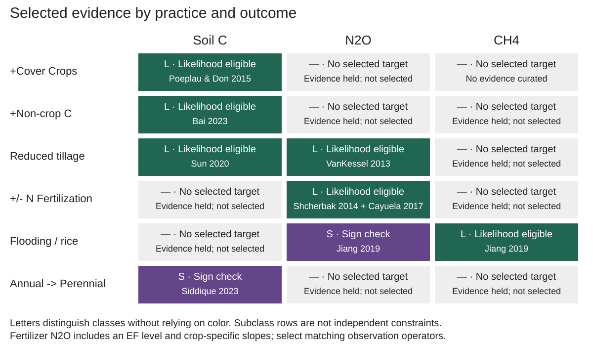

## B1. What this half is for {#b1-what-this-half-is-for}

Six sites cannot establish how California cropland responds to a management change. The statewide evidence is the second constraint: a synthesis of published results for each practice and outcome, assembled for calibration or evaluation after matching climate, practice, duration, and observation support. Evidence used for fitting is not independent validation evidence.

The committed `extracted_evidence.csv` snapshot contains 67 evidence rows. Source review and library availability are recorded separately in `source_audit.csv`; those records should not be inferred from the row count.

## B2. The practice by outcome grid {#b2-the-practice-by-outcome-grid}

{#fig-b2-evidence-grid width=100% fig-align="center" fig-alt="Grid of six practices (+Cover Crops, +Non-crop C, Reduced tillage, +/- N Fertilization, Flooding / rice, Annual -> Perennial) by three outcomes (Soil C, N2O, CH4). Six green fittable cells: +Cover Crops by Soil C (Poeplau 2015), +Non-crop C by Soil C (Bai 2023), Reduced tillage by Soil C (Sun 2020), Reduced tillage by N2O (van Kessel 2013), +/- N Fertilization by N2O (Shcherbak 2014 slope subclasses plus Cayuela 2017 EF level) and Flooding / rice by CH4 (Jiang 2019, 5 subclasses). Two purple sign check cells: Flooding / rice by N2O (Jiang 2019) and Annual -> Perennial by Soil C (Siddique 2023). The other ten cells are grey; +Cover Crops by CH4 is labelled no evidence and Reduced tillage by CH4 is labelled evidence held but not selected. Class letters supplement color."}

Six practices by three outcomes gives 18 cells. 17 have at least one piece of evidence behind them; cover crops and methane is the only cell with nothing in the library at all.

Coverage is not usability, which is what the colouring separates.

| Class | Cells | Meaning |
| :--------- | :---- | :-------------------------------------------------------------------------------------------------------------------------------------------------------------------------------------------------- |
| Fittable | 6 | a selected target has reported or source-derived dispersion; its uncertainty type and referent must match the observation model |
| Sign check | 2 | a point estimate is available but no measured uncertainty has been curated; an assumed sensitivity spread is recorded, not a measured SE or confidence interval |
| No target | 10 | no usable contrast in the evidence, no evidence at all for cover crops and methane, or left out by priority for reduced tillage and methane |

: Classes of practice by outcome cell. {#tbl-b2-cell-classes}

Six cells are fittable: cover crops, non-crop carbon and reduced tillage on soil carbon, reduced tillage on N~2~O, fertilisation on N~2~O, and rice drying on CH~4~.

### The eight selected cells {#the-eight-cells-that-are-used}

Six cells have likelihood-eligible targets, but source-derived dispersion is not interchangeable across rows: SD describes population variability, while SE describes precision on an estimated mean. Match the estimator and uncertainty referent before constructing a likelihood. Standard deviation (SD), standard error (SE), log response ratio (LRR), and emission factor (EF) retain these distinct meanings throughout.

Fertilisation targets include a Mediterranean EF level and crop-specific EF slopes, which measure different quantities. Choose a relevant slope group rather than treating aggregate and overlapping subgroups as independent evidence. Likewise, choose one applicable rice-drying representation; the combined two-or-more-events class overlaps the individual classes.

| Cell | Centre | Spread | Units | Source |
| :-------------------------- | :--------------- | :-------------------------------- | :----------------------------- | :---------------------------- |
| +Cover Crops x Soil C | 0.32 | 0.74 (SD, population) | Mg C ha^-1^ yr^-1^ | Poeplau & Don 2015 |
| Reduced tillage x N~2~O | 0.322 | 0.124 (SE, from 95% CI) | LRR | van Kessel 2013, dry \<10 yr |
| +Non-crop C x Soil C | 0.238 | 0.0028 (SE, from 95% CI) | LRR | Bai 2023 |
| Reduced tillage x Soil C | 0.216 | 0.448 (SD, population) | Mg C ha^-1^ yr^-1^ | Sun 2020 |
| +/- N Fertilization x N~2~O, EF level | 0.50 | 0.0612 (SE, from 95% CI) | % of N applied | Cayuela 2017, Mediterranean |
| +/- N Fertilization x N~2~O, EF slope | 0.0009 to 0.0181 | 0.00028 to 0.00497 (SE, reported) | % points of EF per kg N ha^-1^ | Shcherbak 2014, by crop class |
| Flooding / rice x CH~4~ | -0.399 to -1.394 | 0.117 to 0.182 (SE, from 95% CIs) | LRR | Jiang 2019, by drying events |

: The six fittable cells. {#tbl-b2-fittable-cells}

Two more have a published effect size but no curated measured uncertainty. They retain the assumed sensitivity spread described in B5 and are selected for sign checks, not likelihood use. For rice N~2~O an interval is drawn in Jiang 2019 Figure 2a and could still be digitised.

| Cell | Centre | Spread | Units | Source |
| :---------------------------- | :----- | :----------------------- | :---- | :------------ |
| Flooding / rice x N~2~O | 0.718 | 0.707 (assumed sensitivity scale) | LRR | Jiang 2019 |
| Annual -\> Perennial x Soil C | 0.154 | 0.707 (assumed sensitivity scale) | LRR | Siddique 2023 |

: The two sign-check cells; neither assumed spread is empirical uncertainty. {#tbl-b2-expert-prior-cells}

For the perennial-SOC sign check, the aggregate positive effect is conditional on stand age: the source reports a negative direction below five years and a positive direction beyond ten. Match stand age rather than applying an unconditional positive sign.

The likelihood-eligible targets sit on four scales. Cover crops and reduced tillage on soil carbon are absolute rates in Mg C ha^-1^ yr^-1^; non-crop carbon, reduced tillage on N~2~O and rice methane are log response ratios, which are dimensionless; fertilisation on N~2~O includes both the EF level (% of N applied) and its slope (percentage points per kg N ha^-1^). LRR is ln(intervention/comparator), with the comparator specified in each row's `observation_operator`. Rice drying contrasts compare non-continuous with continuous flooding. They cannot be compared to each other directly, and each has to be matched against the equivalent model quantity on its own scale.

The remaining ten cells carry no target; nine have no usable value, and reduced tillage on methane is left out by priority (B3). That is the finding, not a gap to be filled.

An empty target cell means no target was selected from the reviewed evidence; it does not establish absence of an effect or absence of evidence elsewhere. Distinguish absent evidence, unusable contrasts, and deliberately deferred targets.

## B3. Why so few cells are fittable {#b3-why-so-few-cells-are-fittable}

{#fig-b3-contrast-forest width=100% fig-align="center" fig-alt="Forest plot of nine selected log-response-ratio rows: organic amendment SOC, reduced-tillage N2O, five rice-CH4 drying classes, rice-N2O and perennial-SOC sign checks. Seven rows have source-derived SE intervals; the two sign checks have no uncertainty bars. Multiple rice-drying classes overlap and must not be combined as independent evidence."}

Three limitations affect target selection and interpretation.

**Some sources do not supply usable contrast uncertainty.** A point estimate without measured dispersion can support a conditional sign check, but the assumed sensitivity scales in B5 are not substitutes for empirical SEs. Rice N~2~O has an interval drawn in Jiang 2019 Figure 2a that could be digitized; that uncertainty is not yet curated.

**Subgroups are not independent constraints.** Crop-class slopes and rice-drying classes must match the model comparison. Aggregates overlap their component groups. Duration also matters: the selected dry-climate, short-duration tillage target is not interchangeable with the long-duration alternative.

**Uncertainties can refer to different quantities.** Within-treatment variation does not, by itself, quantify uncertainty in a between-treatment contrast. The target tables identify the uncertainty type, scale, and referent so downstream users can choose an appropriate observation model.

Reduced tillage on methane has a published estimate and SE but is excluded from the selected targets by project priority. Methane targets here focus on water-management changes in rice, not a general tillage response. This selection does not establish whether a particular model implements or reproduces that response.

## B4. How uncertainty is recorded {#b4-how-uncertainty-is-recorded}

A bare number beside a spread does not say enough to be used, because the same figure can mean opposite things. Every row therefore declares three properties explicitly: the **type** of uncertainty, the **scale** it lives on, since a ratio must be on the log scale before it is meaningful, and the **referent**, meaning whether it describes the mean, the population, or a single arm.

The central distinction is precision on an estimated mean versus variability among plots or sites. They enter different parts of an observation model; treating population SD as mean SE, or vice versa, can misrepresent precision.

::: {.callout-note title="A worked example"}
Poeplau and Don report 0.32 ± 0.08 Mg C ha^-1^ yr^-1^ for cover crops on soil carbon. Their methods state that errors in the text are 95 percent confidence intervals, so 0.08 is a confidence interval half width and the standard error on the mean is 0.041.

Their supplement separately provides 139 per plot annual rates, whose standard deviation is 0.744. Both numbers are valid and they answer different questions. **0.041 describes how well the synthesis pins the average. 0.744 describes how much real sites vary.** They differ by a factor of eighteen.

A further subtlety: those 139 rates have a mean of 0.544, whereas the headline 0.32 is the slope of a regression forced through the origin. The centre and the spread are therefore not two descriptions of one distribution, so which estimator is being targeted should be named rather than assumed.
:::

## B5. Assumed sensitivity spreads {#b5-where-the-spread-is-an-expert-informed-prior}

Two cells have a published effect size but no measured contrast uncertainty curated from the source. Their recorded spread, ln(4) / 1.96 ≈ 0.707, is an **assumed log-scale sensitivity scale**, not an empirical SE, confidence interval, or documented elicited expert prior. Under a hypothetical normal distribution on the log scale, it places approximately 95% of that assumed distribution within a factor of four either side of the response ratio.

Both rows are marked `use=sign_check`. Exclude them from a likelihood unless the sensitivity assumption is explicitly adopted and justified; any resulting interval reflects that assumption rather than measured precision.

## B6. What is deliberately excluded {#b6-what-is-deliberately-excluded}

**No pooling across incompatible comparisons.** Selection is by practice, outcome, and subclass; contributing estimates remain unaggregated. An earlier version averaged a positive effect against a negative one and produced an apparent decrease matching neither input.

**No zero effects inferred from null results.** A report of no significant change does not establish an effect size of zero; retain any reported estimate and uncertainty.

**Inventory totals remain contextual references.** The measured Mediterranean EF level is a separately selected likelihood-eligible target, distinct from the Shcherbak EF slopes. Its observation operator is fertilizer-induced N~2~O-N divided by mineral N applied, expressed as a percentage. The same measured EF also appears in `reference_values.csv`; do not count it twice.

**No source used beyond what it measured.** One candidate soil carbon row was dropped after finding the table reported carbon derived from corn rather than total soil carbon, where the total was in fact declining, so the sign would have been backwards.
