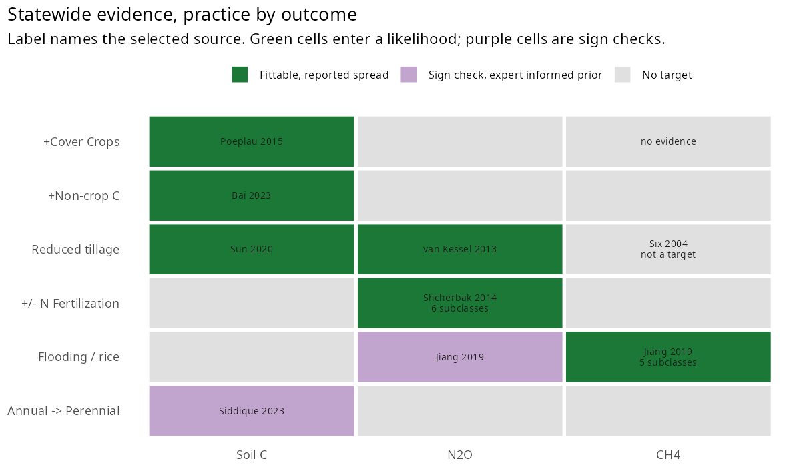
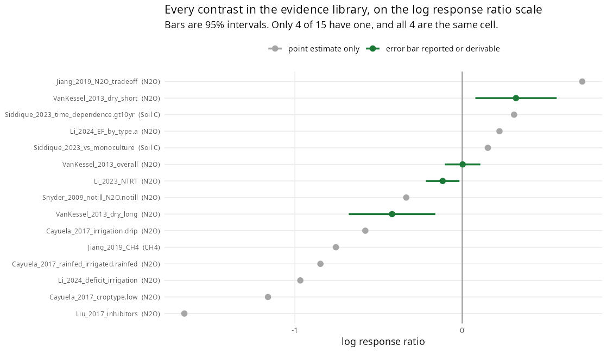

## B1. What this half is for {#b1-what-this-half-is-for}

Six sites cannot establish how California cropland responds to a management change. The statewide evidence is the second constraint: a synthesis of published results for each practice and outcome, assembled so it can serve either as a calibration target or as an acceptance test on model behaviour.

62 evidence rows were extracted from 20 audited sources, 14 of which are held in the shared reference library.

::: {.callout-note title="Repository state, develop 900ffd2 (2026-09-30)"}
The statewide evidence in [`data_raw/statewide_benchmarking`](https://github.com/ccmmf/cal-val-data/tree/develop/data_raw/statewide_benchmarking) now holds 67 evidence rows in [`extracted_evidence.csv`](https://github.com/ccmmf/cal-val-data/blob/develop/data_raw/statewide_benchmarking/extracted_evidence.csv) (text: 62), from 24 audited sources in [`source_audit.csv`](https://github.com/ccmmf/cal-val-data/blob/develop/data_raw/statewide_benchmarking/source_audit.csv) (text: 20), of which 15 are marked as held in the shared Zotero library (`in_zotero` is `yes`; text: 14). The sentence above gives the counts on the source date.
:::

## B2. The practice by outcome grid {#b2-the-practice-by-outcome-grid}

{#fig-b2-evidence-grid width=100% fig-align="center" fig-alt="Grid of six practices (+Cover Crops, +Non-crop C, Reduced tillage, +/- N Fertilization, Flooding / rice, Annual -> Perennial) by three outcomes (Soil C, N2O, CH4). Six green fittable cells: +Cover Crops by Soil C (Poeplau 2015), +Non-crop C by Soil C (Bai 2023), Reduced tillage by Soil C (Sun 2020), Reduced tillage by N2O (van Kessel 2013), +/- N Fertilization by N2O (Shcherbak 2014, 6 subclasses) and Flooding / rice by CH4 (Jiang 2019, 5 subclasses). Two purple sign check cells: Flooding / rice by N2O (Jiang 2019) and Annual -> Perennial by Soil C (Siddique 2023). The other ten cells are grey; +Cover Crops by CH4 is labelled no evidence and Reduced tillage by CH4 is labelled Six 2004, not a target."}

Six practices by three outcomes gives 18 cells. 17 have at least one piece of evidence behind them; cover crops and methane is the only cell with nothing in the library at all.

Coverage is not usability, which is what the colouring separates.

| Class | Cells | Meaning |
| :--------- | :---- | :-------------------------------------------------------------------------------------------------------------------------------------------------------------------------------------------------- |
| Fittable | 6 | a real uncertainty on the contrast is reported, or can be computed from the source's own data, so the cell can enter a likelihood |
| Sign check | 2 | the effect has a magnitude but no spread has been recovered, so it carries an expert informed prior on the spread; it can be fitted if that prior is adopted, and until then serves as a sign check |
| No target | 10 | no usable contrast in the evidence, no evidence at all for cover crops and methane, or left out by priority for reduced tillage and methane |

: Classes of practice by outcome cell. {#tbl-b2-cell-classes}

Six cells are fittable: cover crops, non-crop carbon and reduced tillage on soil carbon, reduced tillage on N~2~O, fertilisation on N~2~O, and rice drying on CH~4~.

### The eight cells that are used {#the-eight-cells-that-are-used}

Six cells are fittable. Their spread comes from the source itself, so they can enter a likelihood directly. For fertilisation and rice methane the rows are held by crop class and by number of drying events, and only the one matching a run is used.

| Cell | Centre | Spread | Units | Source |
| :-------------------------- | :--------------- | :-------------------------------- | :----------------------------- | :---------------------------- |
| +Cover Crops x Soil C | 0.32 | 0.74 (SD, population) | Mg C ha^-1^ yr^-1^ | Poeplau & Don 2015 |
| Reduced tillage x N~2~O | 0.322 | 0.124 (SE, from 95% CI) | LRR | van Kessel 2013, dry \<10 yr |
| +Non-crop C x Soil C | 0.238 | 0.0028 (SE, from 95% CI) | LRR | Bai 2023 |
| Reduced tillage x Soil C | 0.216 | 0.448 (SD, population) | Mg C ha^-1^ yr^-1^ | Sun 2020 |
| +/- N Fertilization x N~2~O | 0.0009 to 0.0181 | 0.00028 to 0.00497 (SE, reported) | % points of EF per kg N ha^-1^ | Shcherbak 2014, by crop class |
| Flooding / rice x CH~4~ | -0.399 to -1.394 | 0.117 to 0.182 (SE, from 95% CIs) | LRR | Jiang 2019, by drying events |

: The six fittable cells. {#tbl-b2-fittable-cells}

Two more have a published effect size but no printed dispersion, so they carry the expert informed prior on the spread described in B5 and serve as sign checks unless that prior is adopted in the likelihood. For rice N~2~O an interval is drawn in Jiang 2019 Figure 2a and could still be digitised.

| Cell | Centre | Spread | Units | Source |
| :---------------------------- | :----- | :----------------------- | :---- | :------------ |
| Flooding / rice x N~2~O | 0.718 | 0.707 (SE, expert prior) | LRR | Jiang 2019 |
| Annual -\> Perennial x Soil C | 0.154 | 0.707 (SE, expert prior) | LRR | Siddique 2023 |

: The two sign check cells, with an expert informed prior on the spread. {#tbl-b2-expert-prior-cells}

Note that the fittable cells sit on three scales. Cover crops and reduced tillage on soil carbon are absolute rates in Mg C ha^-1^ yr^-1^; non-crop carbon, reduced tillage on N~2~O and rice methane are log response ratios, which are dimensionless; fertilisation on N~2~O is a change in emission factor per kg N ha^-1^. They cannot be compared to each other directly, and each has to be matched against the equivalent model quantity on its own scale.

The remaining ten cells carry no target; nine have no usable value, and reduced tillage on methane is left out by priority (B3). That is the finding, not a gap to be filled.

That is a small number and it is better stated plainly than dressed up. Filling the grid was never the objective. An empty cell carries information, because it says the literature does not support a target there, and a manufactured number would be worse than the gap.

## B3. Why so few cells are fittable {#b3-why-so-few-cells-are-fittable}

{#fig-b3-contrast-forest width=100% fig-align="center" fig-alt="Dot plot of 15 named contrasts on a log response ratio axis from about -1.7 to 0.7, with a vertical line at 0. Eleven grey points have no interval, from Liu_2017_inhibitors (N2O) near -1.65 up to Jiang_2019_N2O_tradeoff (N2O) near 0.72, and include Cayuela_2017, Li_2024, Snyder_2009, Siddique_2023 and Jiang_2019_CH4 contrasts. Four green points with 95 percent interval bars, all N2O, are VanKessel_2013_dry_short at about 0.32, VanKessel_2013_overall at about 0, Li_2023_NTRT at about -0.12 and VanKessel_2013_dry_long at about -0.42."}

The figure shows the library as first assembled. This is the clearest single view of the problem. Fifteen contrasts are expressed as log response ratios. Four carry an interval. Eleven are point estimates with nothing around them.

Three distinct causes sit behind that, and they have different remedies.

**Most sources report a ratio with no dispersion.** The eleven grey points are ratios of two published means. Since the figure was made, four more cells have gained a spread. Rice methane uses the confidence intervals Jiang 2019 reports for each number of drying events. Non-crop carbon and reduced tillage on soil carbon moved to newer syntheses: Bai 2023, which reports a confidence interval, in place of Vicente-Vicente 2016, and Sun 2020 in place of Robertson 2000, with the spread computed from the site data in its Table S1. Fertilisation on N~2~O comes from Shcherbak 2014, whose supplementary Table S3 reports standard errors by crop class. These now enter the likelihood (B2). The two with no printed spread carry an expert informed prior on the spread (B5), although for rice N~2~O an interval is drawn in Jiang 2019 Figure 2a and could still be digitised.

**The four that do have intervals are not four constraints.** All of them are reduced tillage on N~2~O, so they are alternatives for a single cell. The figure also shows why pooling them would be wrong: the two van Kessel duration subgroups are one response changing with time since adoption, positive under 10 years and negative after, so the target is matched to adoption age rather than averaged.

**Some reported uncertainties describe a different quantity from the one being targeted.** A standard deviation across the plots of one treatment arm is not the uncertainty on the difference between arms, and treating it as such would underestimate . Each row now records what its uncertainty applies to, so this cannot be misread downstream.

One further case is a matter of scope. Reduced tillage on methane has a real published error bar, and tillage does enter the SIPNET methane formulation: it speeds decomposition, which leaves less carbon substrate for methane production. It can be sign checked, and a model that does not respond, or responds in the wrong direction, fails that check and warrants further investigation. It is left out of the targets by priority rather than because it cannot be used, as the next paragraph explains.

The dataset focuses on the response of methane to water management in rice systems because this is the primary source of cropland CH~4~.

## B4. How uncertainty is recorded {#b4-how-uncertainty-is-recorded}

A bare number beside a spread does not say enough to be used, because the same figure can mean opposite things. Every row therefore declares three properties explicitly: the **type** of uncertainty, the **scale** it lives on, since a ratio must be on the log scale before it is meaningful, and the **referent**, meaning whether it describes the mean, the population, or a single arm.

The distinction that matters most is precision against variability. An uncertainty on a mean tightens a posterior; a spread across a population should widen it. Reading one as the other is the easiest route to a calibration that is confident and wrong.

::: {.callout-note title="A worked example"}
Poeplau and Don report 0.32 ± 0.08 Mg C ha^-1^ yr^-1^ for cover crops on soil carbon. Their methods state that errors in the text are 95 percent confidence intervals, so 0.08 is a confidence interval half width and the standard error on the mean is 0.041.

Their supplement separately provides 139 per plot annual rates, whose standard deviation is 0.744. Both numbers are valid and they answer different questions. **0.041 describes how well the synthesis pins the average. 0.744 describes how much real sites vary.** They differ by a factor of eighteen.

A further subtlety: those 139 rates have a mean of 0.544, whereas the headline 0.32 is the slope of a regression forced through the origin. The centre and the spread are therefore not two descriptions of one distribution, so which estimator is being targeted should be named rather than assumed.
:::

## B5. Where the spread is an expert informed prior {#b5-where-the-spread-is-an-expert-informed-prior}

Two cells have a published effect size but no printed dispersion in the source. Rather than discarding them or inventing a precise figure, they carry a stated expert informed prior on the spread: the 95 percent interval spans a factor of four either side of the estimate, making the standard error ln(4) / 1.96, or 0.707 on the log scale.

In the data tables every such row is marked as an assumed spread used for sign checks, so any analysis restricted to reported uncertainty can exclude them in a single step.

## B6. What is deliberately excluded {#b6-what-is-deliberately-excluded}

**No pooling across studies that disagree.** Each cell selects one row and retains the others beside it, unaggregated. An earlier version averaged a positive effect against a negative one and produced an apparent decrease matching neither input.

**No effect sizes derived from null results.** A paper reporting no significant change is an absence of an effect size, not an effect size of zero.

**No absolute levels among the targets.** Inventory totals and emission factors are comparison values rather than calibration targets, and are held separately.

**No source used beyond what it measured.** One candidate soil carbon row was dropped after finding the table reported carbon derived from corn rather than total soil carbon, where the total was in fact declining, so the sign would have been backwards.
